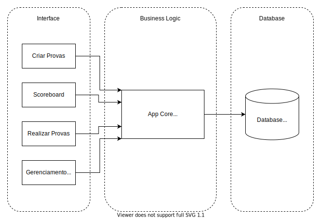

## AvaliaERE
This is an Microsoft Teams App with college purpose.

## Introduction
This APP was developed as a work in the discipline of Software Engineering at UFMG - Prof. Marco Tulio Valente - mtov@dcc.ufmg.br

## Features
- Creation of exams and assignments reminder
- Enabling notifications
- Place where the student can add their grades for follow-up during the semester

## Technology:
- Microsoft Toolkit (VSCode)
- postgresql
- Javascript (ReactJS)
- GitHub

## Architecture
This project follows the "Three Tier Archicture" pattern as shown in the image below.

## Product Backlog and tasks
1. Creating an exam:
	1. The teacher creates a multiple-choice form with a defined grade for each question.
2. Schedule an exam:
	1. The teacher schedules an exam in Microsof Teams app which is visible in calendar for students.
3. Schedule notifications:
	1. When the teacher schedules a test, he also can send extra notifications for students in MS Teams and e-mail.
4. Doing the test:
	1. The student accesses the test form at the scheduled time and answer the questions.
5. Generating result:
	1. After the student answers the test, the grade is automatically generated and, after the test time ends, the grade is posted in the system.
6. Checking grades:
	1. The student accesses their own grades and the class's average grades.
	2. The teacher accesses each student's grades and overall class statistics.
7. Score board:
	1. The student can add grades from other subjects in the score board.

## Sprint Backlog
- Frontend:
	- Exam creation interface (1.1) [Douglas]
	- Scheduling interface (2.1, 3.1) [Hene]
	- Test taking interface (4.1) [Guilherme]
	- Score board interface (6.1, 6.2, 7.1) [Emiliano]
- Backend:
	- Exams database (1.1, 2.1, 5.1) [Mayumi]
	- Grades databes (5.1, 6.1, 6.2) [Luis]
- Notification System:
	- Teams (2.1, 3.1) [Guilherme]
	- Email (2.1, 3.1) [Guilherme]
- Integration:
	- Backend-frontend binding layer (1-6) [Hene]

## Contact the Authors

Carolina Mayumi: `carolmayumimg@ufmg.br`  
Douglas Coutinho `douglasvc@ufmg.br`  
Emiliano Alves `emilianotca@ufmg.br`  
Guilherme Amorim: `guiguitz@ufmg.br`  
Hene Saud: `henesaud@ufmg.br`  
Luis Henrique Vieira `luishlav@ufmg.br`  
